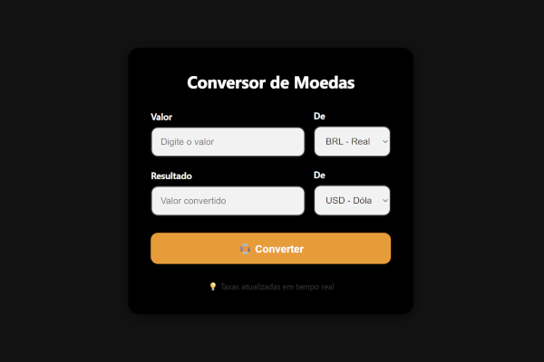

# 💱 Conversor de Moedas

Um conversor de moedas simples e funcional que utiliza uma API para buscar taxas de câmbio em tempo real. Desenvolvido com HTML, CSS e JavaScript puro.

## 🔍 Funcionalidades

- Conversão entre múltiplas moedas (BRL, USD, EUR, JPY, etc.)
- Integração com a [ExchangeRate API](https://www.exchangerate-api.com/) para obter cotações atualizadas
- Interface amigável com design responsivo e tema escuro
- Exibição clara de erros em caso de falha na conversão

## 🧪 Tecnologias Utilizadas

- HTML5
- CSS3 (com custom properties e animações)
- JavaScript (fetch API, DOM manipulation)

## 📸 Preview

 <!-- Você pode adicionar uma imagem real aqui no seu repositório -->
